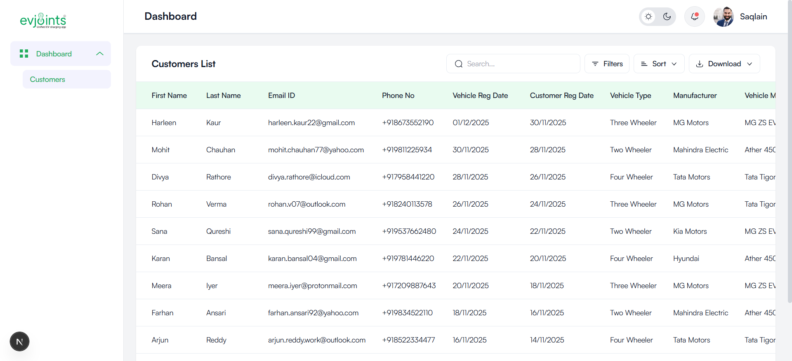

# EVJoints Admin Dashboard

A modern, responsive admin dashboard built for managing EV charging stations and customer data. This project is built using **Next.js**, **Tailwind CSS**, and **TypeScript**.



## 🚀 Features Implemented

### 👥 Customers Management
- **Comprehensive Data Table**: View detailed customer information including vehicle details, registration dates, and device info.
- **Advanced Search**: Real-time search functionality to find customers by First Name, Last Name, or Email.
- **Filtering**: Filter customer records by **Registration Date** range.
- **Sorting**: Sort data by:
  - Name (A-Z, Z-A)
  - Date (Newest First, Oldest First)
- **Pagination**: Efficient data navigation with customizable rows per page.
- **Data Export**: Download customer data in **CSV** and **Excel** formats.

### 🎨 UI & UX
- **Responsive Design**: Fully responsive layout that works seamlessly on desktop and mobile devices.
- **Dark Mode Support**: Built-in theme toggle for Light and Dark modes.
- **Sidebar Navigation**: Collapsible sidebar for easy navigation.
- **Modern Aesthetics**: Clean and professional design using the Satoshi font family.

## 🛠️ Tech Stack

- **Framework**: [Next.js](https://nextjs.org/)
- **Styling**: [Tailwind CSS](https://tailwindcss.com/)
- **Language**: [TypeScript](https://www.typescriptlang.org/)
- **Icons**: Custom SVG Icons

## 📦 Getting Started

1. **Install Dependencies**
   ```bash
   npm install
   ```

2. **Run Development Server**
   ```bash
   npm run dev
   ```

3. **Open in Browser**
   Navigate to [http://localhost:3000](http://localhost:3000) to view the dashboard.
