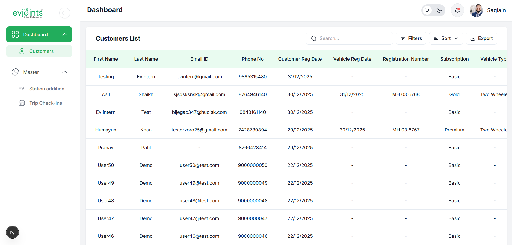

# EVJoints Admin Dashboard

A state-of-the-art, responsive admin dashboard tailored for managing the EVJoints ecosystem. This platform empowers administrators to oversee EV charging station submissions, monitor trip check-ins, and manage customer data with precision and ease. Built with **Next.js 15+**, **Tailwind CSS**, and **TypeScript**, it prioritizes performance, scalability, and a premium "Elite" user experience.



## 🚀 Key Features

### 🔌 Station Submissions Management
*   **Approval Workflow**: Review, approve, or reject new charging station submissions with a streamlined interface.
*   **Detailed Insights**: View comprehensive station details including connector types (CCS2, Type 2, etc.), power ratings, and location data.
*   **Status Tracking**: Visual status indicators (Pending, Approved, Rejected) with detailed rejection reasons.
*   **Edit Capabilities**: Modify station details directly from the dashboard before approval.
*   **Validation**: Robust validation to ensure data integrity before database commitment.

### 🚗 Trip Check-ins Oversight
*   **Story Management**: Review and moderate user-generated trip stories and check-ins.
*   **Visual Feedback**: Quick access to trip photos and user comments.
*   **Verification**: Validate check-ins to ensure community guidelines are met.
*   **Geospacial Data**:  Analyze source and destination data (planned).

### 👥 Comprehensive Customer Management
*   **Deep Data Access**: Explore detailed customer profiles including vehicle registration numbers (Indian format), device models, and app versions.
*   **Advanced Formatting**: Intelligent formatting for vehicle plates (e.g., `MH 12 AB 1234`) and capitalized device details.
*   **Smart Search**: Real-time filtering by First Name, Last Name, Email, or Phone.
*   **Flexible Export**: Export filtered datasets to **CSV** for offline analysis, with Excel compatibility.

### 🎨 Premium UI/UX ("Elite" Design System)
*   **Visual Consistency**: Strict adherence to a centered-content philosophy for maximum readability.
*   **Data Density Control**: Customizable pagination (10, 20, 50, 100 rows) to suit different viewing needs.
*   **Zebra Striping**: Alternating row colors for enhanced data scanning.
*   **Responsive & Adaptive**: Fluid layouts that adapt to desktops, tablets, and distinct Dark/Light modes.
*   **Interactive Elements**: Smooth hover effects, modal transitions, and intuitive dropdowns.

## 🛠️ Technology Stack

*   **Core**: [Next.js 15+](https://nextjs.org/) (App Router), [React 19](https://react.dev/)
*   **Language**: [TypeScript](https://www.typescriptlang.org/) (Strict Mode)
*   **Styling**: [Tailwind CSS](https://tailwindcss.com/)
*   **State Management**: React Hooks (`useState`, `useEffect`, `useMemo`)
*   **Data Fetching**: Server-side pagination and sorting integration
*   **Icons**: Custom SVG set + Phosphor/Heroicons concepts

## 📂 Project Structure

```bash
src/
├── app/                    # Next.js App Router pages
├── components/
│   ├── Tables/             # Complex table components (Customers, Stations)
│   ├── TripCheckins/       # Trip-specific components
│   ├── ui/                 # Reusable UI primitives (Buttons, Modals, Inputs)
│   ├── Layouts/            # Dashboard layout wrappers
│   └── Header/Sidebar      # Navigation components
├── lib/                    # API definitions and helpers
└── types/                  # TypeScript type definitions
```

## 📦 precise setup & Installation

1.  **Clone the Repository**
    ```bash
    git clone https://github.com/HumayunK01/EVJoints-Admin-Dashboard.git
    cd EVJoints-Admin-Dashboard
    ```

2.  **Install Dependencies**
    ```bash
    npm install
    ```

3.  **Environment Setup**
    Create a `.env.local` file in the root directory and add necessary API keys:
    ```env
    NEXT_PUBLIC_API_URL=https://your-api-url.com
    ```

4.  **Run Development Server**
    ```bash
    npm run dev
    ```

5.  **Build for Production**
    ```bash
    npm run build
    npm start
    ```

## 🤝 Contribution Guidelines

*   **Design First**: Always adhere to the "Elite" design principles—centered content, consistent padding, and premium assets.
*   **Type Safety**: Ensure strict TypeScript types for all new components and API responses.
*   **Clean Code**: Follow the existing module structure; keep components small and focused.

---

© 2024 EVJoints. All rights reserved.
